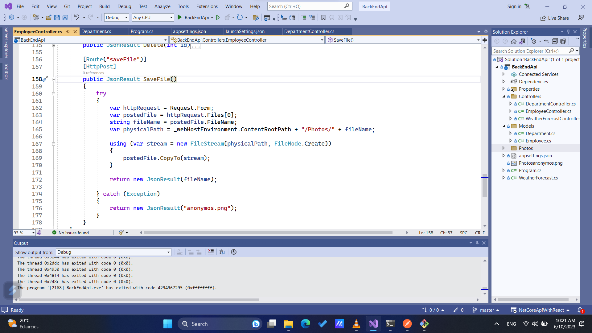
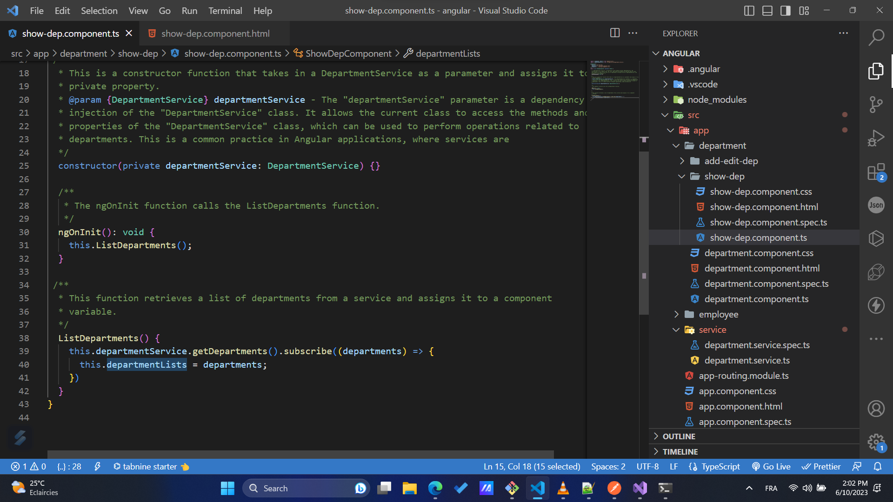

# NET CORE API 

  

# Connection String SQL SERVER

  

# Enable Cors AND Serialisable
  

# Department Controller
  

# Controller Method Get By Id
  

# Controller Method INSERT NEW DEPARTMENT
  

# Controller Method UPDTED EXISTING DEPARTMENT

  

# Controller Method DELETED  DEPARTMENT

  

# Configuration Path to Store Images

  
  

##########################################################################################

# Angular

 
 

# Service List Department
  

# Get List Department inside Component
  
  
